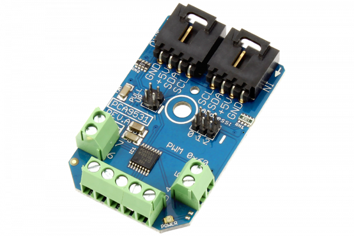

# PCA9531

The PCA9531 is an 8-bit I2C bus PWM controller optimized for dimming LEDs in 256 discrete steps for Red/Green/Blue (RGB) color mixing and back light applications.
This Device is available from www.ncd.io 

[SKU: PCA9531_I2CS]

(https://store.ncd.io/product/pca9531-2-channel-8-bit-pwm-with-8-outputs-gpio-i2c-led-dimmer/)
This Sample code can be used with Arduino.

Hardware needed to interface PCA9531 sensor with Arduino

1. <a href="https://store.ncd.io/product/i2c-shield-for-arduino-nano/">Arduino Nano</a>

2. <a href="https://store.ncd.io/product/i2c-shield-for-arduino-micro-with-i2c-expansion-port/">Arduino Micro</a>

3. <a href="https://store.ncd.io/product/i2c-shield-for-arduino-uno/">Arduino uno</a>

4. <a href="https://store.ncd.io/product/dual-i2c-shield-for-arduino-due-with-modular-communications-interface/">Arduino Due</a>

5. <a href="https://store.ncd.io/product/pca9531-2-channel-8-bit-pwm-with-8-outputs-gpio-i2c-led-dimmer/">PCA9531 8Bit 2Channel PWM Sensor</a>

6. <a href="https://store.ncd.io/product/i%C2%B2c-cable/">I2C Cable</a>

PCA9531:

The PCA9531 is an 8-bit I2C bus PWM controller optimized for dimming LEDs in 256 discrete steps for Red/Green/Blue (RGB) color mixing and back light applications.

Applications:

• Back light applications.

• Color mixing.

How to Use the PCA9531 Arduino Library

The PCA9531 has a number of settings, which can be configured based on user requirements.
          
1.Address calling:The following command is used to call the PCA9531 sensor to begin the transmission.

           pca.getAddr_PCA9531(PCA9531_DEFAULT_ADDRESS);           // 0x60
            
2.Frequency setup:The following command is used to set the frequency of channel 0.

            pca.setFreqPSC0(75);        // Period of Blink = 0.5 sec
             
3.PWM setup:The following command is used to set the duty cycle of channel 0.             
             
            pca.setPWM0(128);           // Duty Cycle = 50       

4.Frequency setup:The following command is used to set the frequency of channel 1.

            pca.setFreqPSC1(75);        // Period of Blink = 0.5 sec
             
5.PWM setup:The following command is used to set the duty cycle of channel 1.             
             
            pca.setPWM1(128);           // Duty Cycle = 50       
